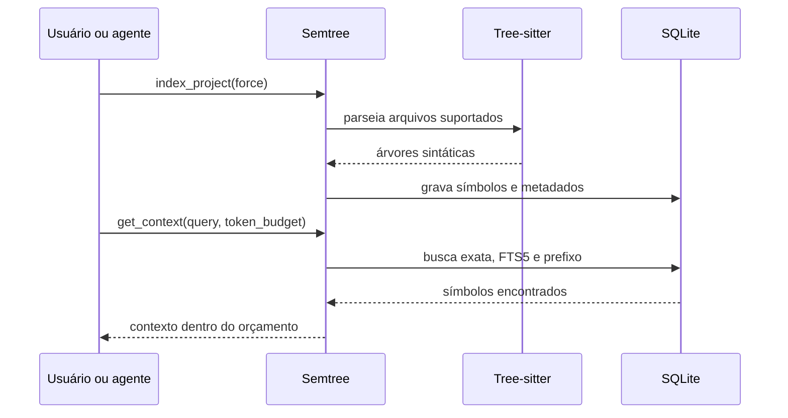

# Como funciona

## Visão geral

## 1. Descoberta e extração

O indexador percorre extensões configuradas, respeita o `.gitignore`, ignora diretórios excluídos e limita o tamanho dos arquivos. A extração estrutural implementada cobre:

- Python;
- JavaScript e TypeScript;
- Go;
- Rust;
- Java;
- C e C++.

Para essas linguagens, visitors específicos extraem os tipos de símbolo que a implementação reconhece, como funções, métodos, classes, tipos e constantes. Assinaturas e, quando disponíveis, docstrings acompanham os símbolos. O Semtree não resolve imports, dependências entre módulos, chamadas ou tipos como um LSP.

Se uma gramática opcional não estiver instalada, algumas linguagens usam um fallback por expressões regulares. Arquivos de outras extensões configuradas podem ser registrados no índice sem produzir símbolos estruturais.

## 2. Persistência local

O banco padrão fica em `.ctx/index.db`. Ele armazena arquivos, hashes, símbolos, assinaturas, docstrings, metadados de Git e entradas criadas pelos comandos de memória.

O SQLite mantém um índice FTS5 sobre nome, assinatura e docstring. O schema reserva uma coluna para embeddings, mas a versão atual não cria embeddings nem executa busca vetorial.

## 3. Recuperação e contexto

Para uma consulta, o Semtree:

1. procura primeiro correspondência exata de nome;
2. consulta o FTS5 por palavras do nome, assinatura e docstring;
3. usa prefixo como fallback quando as buscas anteriores não retornam resultado;
4. aplica a política do tipo de tarefa para ordenar e limitar símbolos;
5. formata o resultado dentro do orçamento informado.

O contexto pode incluir assinaturas, docstrings, metadados de Git e uma árvore de arquivos, conforme o nível e a política escolhidos. Não há reranking por embeddings na implementação atual.

## Limites

- A busca é lexical e estrutural; não compreende o significado do código como um modelo ou LSP.
- Consultas vagas podem omitir símbolos importantes.
- O orçamento limita o volume de saída, mas não garante redução fixa nem qualidade da resposta do assistente.
- A indexação é local. Se um cliente de IA receber o contexto gerado, o provedor desse cliente pode processar o conteúdo segundo suas próprias regras.
- Linguagens e tipos de símbolo têm coberturas diferentes; valide o resultado no seu repositório.

Veja também [Por que tree-sitter](tree-sitter.md), [Benchmark local](../benchmarks.md) e [Privacidade](../privacy.md).
